**zookeeper ： ** 是分布式协调服务系统 🚥。本质上是一个分布式的**小文件**存储系统。目录树存储数据。

**特征：**

1. 全局数据唯一性
2. 可靠性
3. 顺序性 全局有序
4. 数据更新的原子性 （半数以上机器成功）
5. 实时行

**Zookeeper 集群角色**

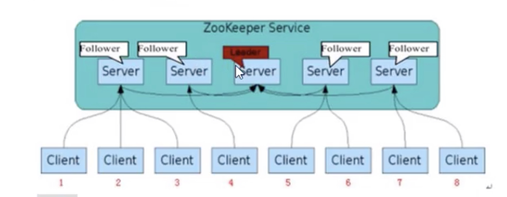

**Leader:**

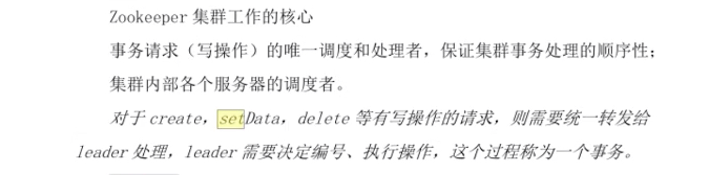

**Follower:**

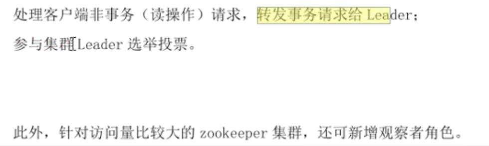

**Observer: (观察者)**

拓展读服务，不参加投票

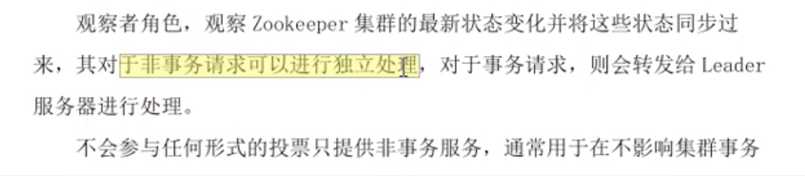

**数据模型**

树形层次结构

1. Znode 兼具文件和目录两种特点
2. Znode既有原子性操作
3. Znode存储数据大小有限制 KB级别
4. Znode通过路径应用

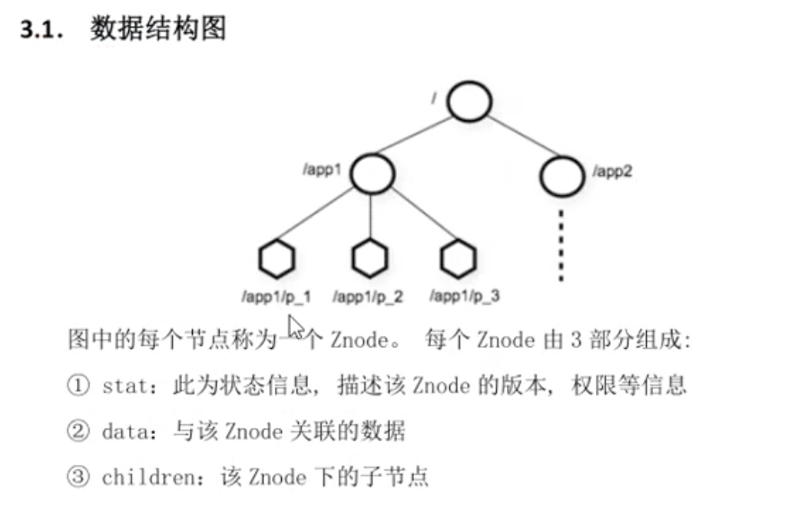

**节点类型**

Znode有两种分别为 **临时节点**和**永久节点**。节点类型在创建时确定。确定后不能修改。

临时节点：客户端断开链接节点自动删除。临时节点下面不允许有子节点。

永杰节点：创建成功后就永久存在

节点属性：

dataVersion

cversion ： 子节点改后 +1

aclVersion：

cZxid：事物性id 创建id

mZxid：事务性id 修改id

Ctime:节点创建时间

mtime：修改

ephemeralOwner:为0 永久节点 不为零临时节点

shell基本操作

链接服务

创建节点

节点读取

更新

删除

quota ： 限制节点 软限制

listquota

setquota

Watcher 

Zookeeper提供了分布式数据发布/订阅功能，以watcher监听机制。设置监听事件

注册监听，监听触发，客户端回调Watcher得到触发事件情况。

Watcher 机制特点

1. 一次性触发
2. 事件封装
3. event异步发送
4. 先注册再触发

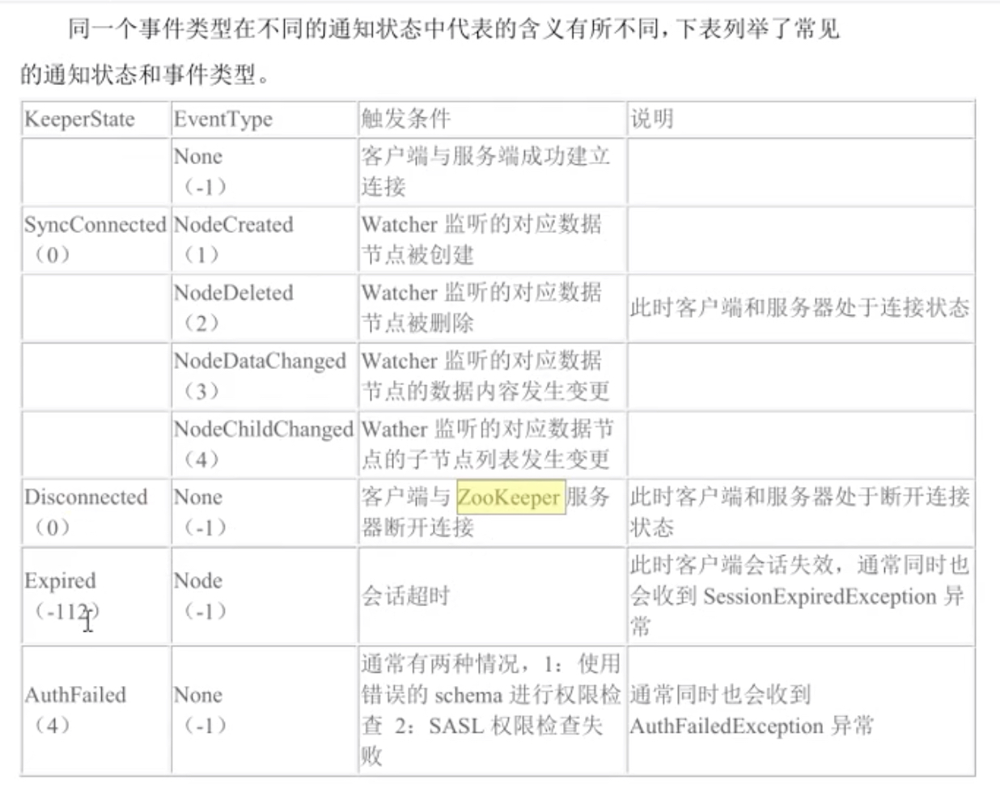

Java api

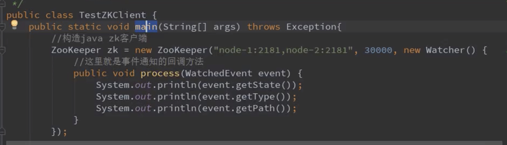

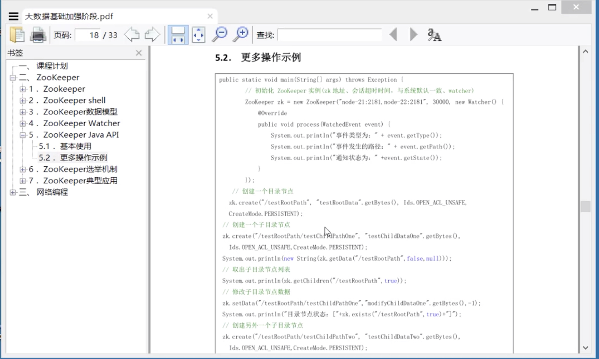

### Zookeeper 选举机制

算法 投票数大于半数则生出

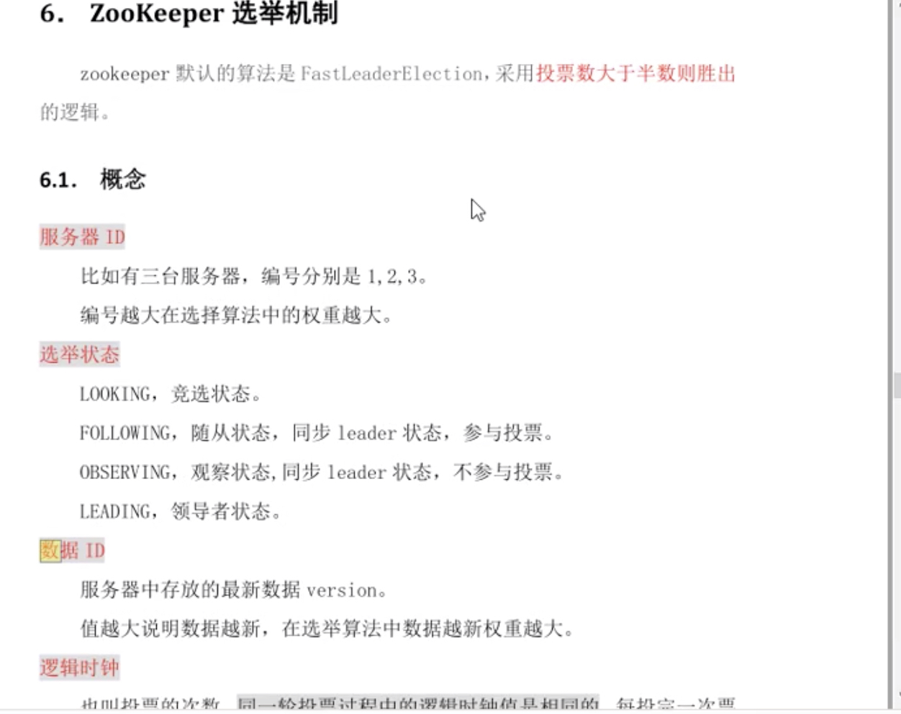

**全新集合选举**  服务器编号

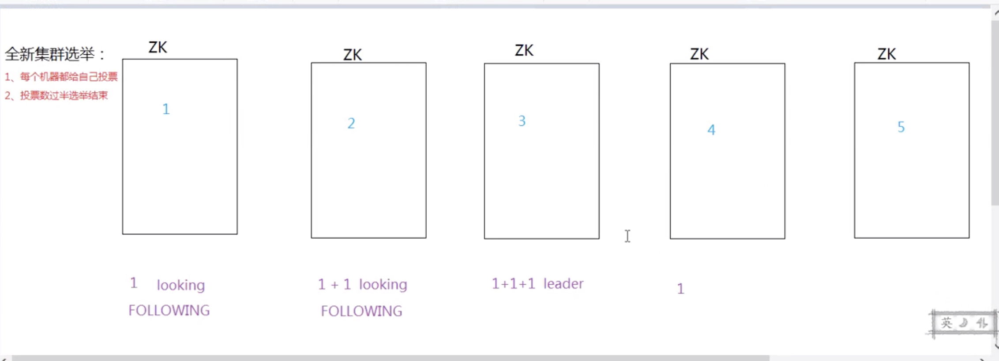

**非全新集合选举**

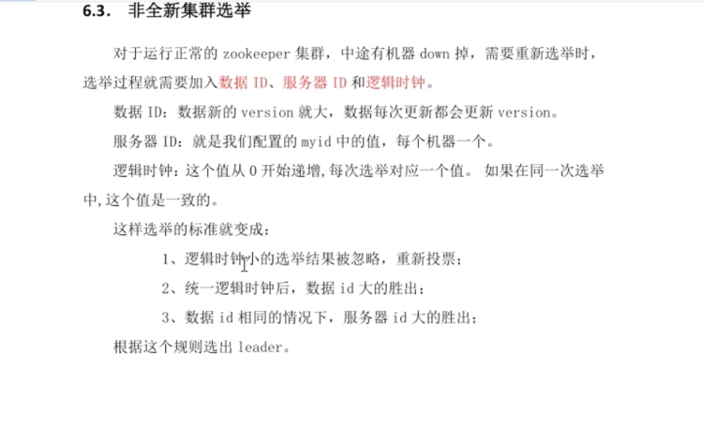

